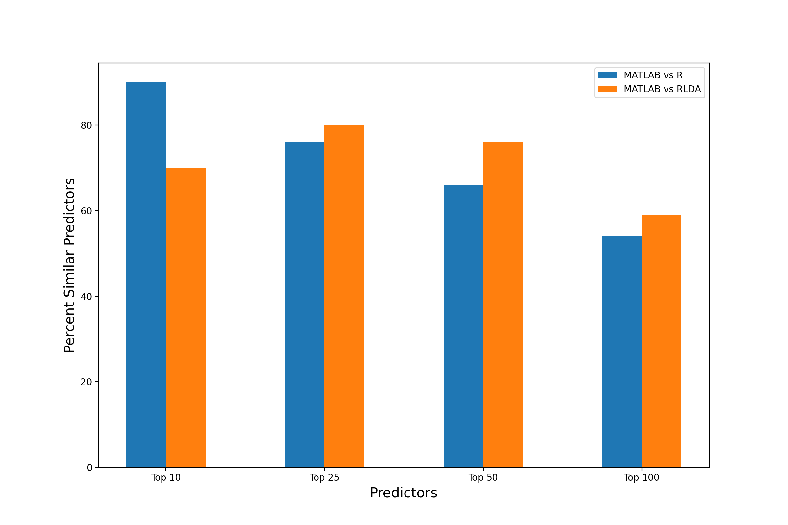

```{r setup, include=FALSE}
knitr::opts_chunk$set(echo = TRUE)
```

## 1. Summary

Here we describe methods to identify which organisms are important predictors of a patient’s
associated response to a ketogenic diet (KD), where response values are designated as either
50% or greater reduction in seizure frequency (Responder (R)), or less than 50% reduction in
seizure frequency (Non-Responder (NR)). The data used can be described as metagenomics
samples collected from 12 patients with Epilepsy before (PA; sample data 1) undergoing a KD for
3 months, and after (PB; sample data 2)$^1$ . Sample data was paired with known response values
collected at the completion of the study (R or NR), allowing sophisticated tools such as Machine
Learning to identify important predictors associated with the response value and the gut-microbiome profile of the patient. Here, we implement k-Nearest Neighbors, Random Forest and Partial Least Squares Discriminant Analysis methods using the Caret package in R, where we demonstrate that it is prudent to evaluate at least the top 25 predictors to identify overlap between R, MATLAB, and HIVE RLDA.

## 2. Objectives

Using machine learning models in R, find model accuracy, prediction accuracy with respect to synthetic (in-silico) data, and important predictors of the dataset.

## 3. Methods
  a. Install the required package containing the machine learning algorithms we'll use:
```{r packages, echo=TRUE}
if (!require('caret')) 
{
  install.packages("caret", dependencies=c("Depends", "Suggests"));
  library(caret);
}
```
  b. Import _"all_patients.csv"_ and _"in_silico.csv"_ into R Studio as the primary dataset and validation dataset respectively:
```{r data}
dataset <- read.csv("all_patients.csv", header=TRUE)
validation <- read.csv("in_silico.csv", header=TRUE)
```
  c. Set-up the test harness to use 10-fold cross validation and use the metric of “Accuracy” to evaluate models. This is a ratio of the number of correctly predicted instances in divided by the total number of instances in the dataset multiplied by 100 to give a percentage.
```{r test harness}
ctrl <- trainControl(method="cv", number=12)
metric <- "Accuracy"
```
  d. Build models "k-Nearest Neighbors" (knn), "Random Forest" (rf), and "Partial Least Squares Discriminant Analysis"(pls), as they performed the best during testing:
```{r models, echo=TRUE}
fit.knn <- train(as.factor(EffSeizures_After)~.,
                    data=dataset,
                    method="knn",
                    metric=metric,
                    trControl=ctrl)
fit.rf <- train(as.factor(EffSeizures_After)~.,
                 data=dataset,
                 method="rf",
                 metric=metric,
                 trControl=ctrl)
fit.pls <- train(as.factor(EffSeizures_After)~.,
                 data=dataset,
                 method="pls",
                 metric=metric,
                 trControl=ctrl)
```
  e. View model accuracy and determine best choice:
```{r model results}
model_results <- resamples(list(knn=fit.knn, rf=fit.rf, pls=fit.pls))
summary(model_results)
```
  f. After choosing "Random Forest" (rf), create predictions using the saved "fit.rf" model and the validation dataset. Then, create a correlation matrix to see how accurate the predictions were:
```{r predictions}
predictions <- predict(fit.rf, validation)
confusionMatrix(predictions, as.factor(validation$EffSeizures_After))
```
### 4. Results
From this, we can see that a Random Forest model can predict the response metric at 97% accuracy when testing said model on in-silico data and training on actual patient data. Below, we can also view the top 25 important predictors in the dataset that have been identified:
```{r important predictors}
important_predictors <- varImp(fit.rf)
plot(important_predictors, top=25)
```
Figure 1: Top 25 Important Predictors

### 5. Appendix A: Comparing Top Predictors
  a. If we take a look at the Top 10, 25, 50 and 100 similar predictors between R, MATLAB and HIVE RLDA when using the same _"all_patients.csv"_ dataset, the following graph can be generated. It is important to note that the values have been normalized to the sample size of predictors.
```{r python-setup, include=FALSE}
library(reticulate)
use_python("/jamziegl/applications/Python 3.9")
```

```{python include=FALSE}
import pandas as pd
import numpy as np
from matplotlib import pyplot as plt

df=pd.read_excel('importance_comparisons.xlsx')
MATLAB=[]
for name in df['MATLAB']:
    MATLAB.append(name[:-1])
df.drop("MATLAB", inplace=True, axis=1, errors='ignore')
df.insert(0, "MATLAB", pd.Series(MATLAB))

MATLAB_set=set(df['MATLAB'])
top10_1=list(MATLAB_set.intersection(df['R'][0:10]))
top10_2=list(MATLAB_set.intersection(df['RLDA'][0:10]))
top25_1=list(MATLAB_set.intersection(df['R'][0:25]))
top25_2=list(MATLAB_set.intersection(df['RLDA'][0:25]))
top50_1=list(MATLAB_set.intersection(df['R'][0:50]))
top50_2=list(MATLAB_set.intersection(df['RLDA'][0:50]))
top100_1=list(MATLAB_set.intersection(df['R']))
top100_2=list(MATLAB_set.intersection(df['RLDA']))
percent_common_orgs_1 = [len(top10_1)*10,len(top25_1)*4,len(top50_1)*2,len(top100_1)]
percent_common_orgs_2 = [len(top10_2)*10,len(top25_2)*4,len(top50_2)*2,len(top100_2)]

barWidth = 0.25
fig = plt.subplots(figsize =(12, 8))
br1 = np.arange(4)
br2 = [x + barWidth for x in br1]
br3 = [x + barWidth for x in br2]
plt.bar(br1, percent_common_orgs_1, width = barWidth,
        label ='MATLAB vs R')
plt.bar(br2, percent_common_orgs_2, width = barWidth,
        label ='MATLAB vs RLDA')
plt.xlabel('Predictors', fontsize = 15)
plt.ylabel('Percent Similar Predictors', fontsize = 15)
plt.xticks([r + 0.125 for r in range(4)],
        ['Top 10', 'Top 25', 'Top 50', 'Top 100']) 
plt.legend()
plt.show()
```


